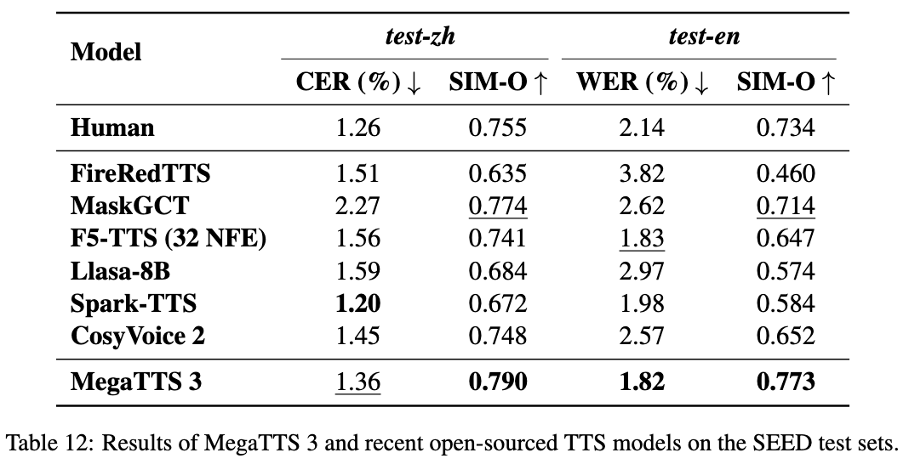
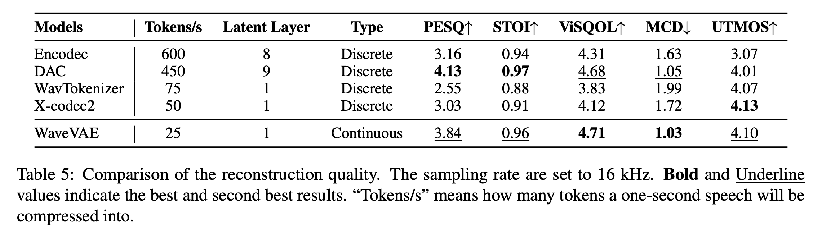

<div align="center">
    <h1>
    MegaTTS 3 
    </h1>
    <p>
    Official PyTorch Implementation<br>
    </p>
    <p></p>
    
    
</div>

## Key features
- 🚀**Lightweight and Efficient:** The backbone of the TTS Diffusion Transformer has only 0.45B parameters.
- 🎧**Ultra High-Quality Voice Cloning:** See the demo video below! We also report results of recent TTS models on the Seed test sets in the following table. 🎉Submit a sample on [link2](https://drive.google.com/drive/folders/1gCWL1y_2xu9nIFhUX_OW5MbcFuB7J5Cl?usp=sharing) to receive voice latents you can use locally.
- 🌍**Bilingual Support:** Supports both Chinese and English, and code-switching.
- ✍️**Controllable:** Supports accent intensity control ✅ and fine-grained pronunciation/duration adjustment (coming soon).

[MegaTTS 3 Demo Video](https://github.com/user-attachments/assets/0174c111-f392-4376-a34b-0b5b8164aacc)

<div style='width:100%;text-align:center'>

</div>

## 🎯Roadmap

- **[2025-03-22]** Our project has been released!


## Installation
**Requirements (for Linux)**
``` sh
# Create a python 3.9 conda env (you could also use virtualenv)
conda create -n megatts3-env python=3.9
conda activate megatts3-env
pip install -r requirements.txt

# Set the root directory
export PYTHONPATH="/path/to/MegaTTS3:$PYTHONPATH" #Linux/Mac
# If you encounter bugs with pydantic in inference, you should check the version of pydantic and gradio.
```

**Requirements (for Windows)**
``` sh
# [The Windows version is currently under testing]
# Comment below dependence in requirements.txt:
# # WeTextProcessing==1.0.4.1

# Create a python 3.10 conda env (you could also use virtualenv)
conda create -n megatts3-env python=3.10
conda activate megatts3-env
pip install -r requirements.txt
conda install -y -c conda-forge pynini==2.1.5
pip install WeTextProcessing==1.0.3

# [Optional] If you want GPU inference, you may need to install specific version of PyTorch for your GPU from https://pytorch.org/.
pip3 install torch torchvision torchaudio --index-url https://download.pytorch.org/whl/cu126

# Install specific version of gradio
# If you encounter bugs with pydantic in inference, you should check the version of pydantic and gradio.
pip install gradio==4.12.0 gradio_client==0.8.0

# Set environment variable
set PYTHONPATH="C:\path\to\MegaTTS3;%PYTHONPATH%"
conda env config vars set PYTHONPATH="C:\path\to\MegaTTS3;%PYTHONPATH%" # For conda users
# [Optional] Set GPU
set CUDA_VISIBLE_DEVICES=0
```

**Requirements (for Docker)**
``` sh
# [The Docker version is currently under testing]
# ! You should download the pretrained checkpoint before running the following command
docker build . -t megatts3:latest

# For GPU inference
docker run -it -p 7929:7929 --gpus all -e CUDA_VISIBLE_DEVICES=0 megatts3:latest
# For CPU inference
docker run -it -p 7929:7929  megatts3:latest

# Visit http://0.0.0.0:7929/ for gradio.
```


**Model Download**

The pretrained checkpoint can be found at [Google Drive](https://drive.google.com/drive/folders/1CidiSqtHgJTBDAHQ746_on_YR0boHDYB?usp=sharing) or [Huggingface](https://huggingface.co/ByteDance/MegaTTS3). Please download them and put them to ``./checkpoints/xxx``.

> [!IMPORTANT]  
> For security issues, we do not upload the parameters of WaveVAE encoder to the above links. You can only use the pre-extracted latents from [link1](https://drive.google.com/drive/folders/1QhcHWcy20JfqWjgqZX1YM3I6i9u4oNlr?usp=sharing) for inference. If you want to synthesize speech for speaker A, you need "A.wav" and "A.npy" in the same directory. If you have any questions or suggestions for our model, please email us.
> 
> This project is primarily intended for academic purposes. For academic datasets requiring evaluation, you may upload them to the voice request queue in [link2](https://drive.google.com/drive/folders/1gCWL1y_2xu9nIFhUX_OW5MbcFuB7J5Cl?usp=sharing) (within 24s for each clip). After verifying that your uploaded voices are free from safety issues, we will upload their latent files to [link1](https://drive.google.com/drive/folders/1QhcHWcy20JfqWjgqZX1YM3I6i9u4oNlr?usp=sharing) as soon as possible.
> 
> In the coming days, we will also prepare and release the latent representations for some common TTS benchmarks.

## Inference
**Command-Line Usage (Standard)**
``` bash
# p_w (intelligibility weight), t_w (similarity weight). Typically, prompt with more noises requires higher p_w and t_w
CUDA_VISIBLE_DEVICES=0 python tts/infer_cli.py --input_wav 'assets/Chinese_prompt.wav'  --input_text "另一边的桌上,一位读书人嗤之以鼻道,'佛子三藏,神子燕小鱼是什么样的人物,李家的那个李子夜如何与他们相提并论？'" --output_dir ./gen

# As long as audio volume and pronunciation are appropriate, increasing --t_w within reasonable ranges (2.0~5.0)
# will increase the generated speech's expressiveness and similarity (especially for some emotional cases).
CUDA_VISIBLE_DEVICES=0 python tts/infer_cli.py --input_wav 'assets/English_prompt.wav' --input_text 'As his long promised tariff threat turned into reality this week, top human advisers began fielding a wave of calls from business leaders, particularly in the automotive sector, along with lawmakers who were sounding the alarm.' --output_dir ./gen --p_w 2.0 --t_w 3.0
```
**Command-Line Usage (for TTS with Accents)**
``` bash
# When p_w (intelligibility weight) ≈ 1.0, the generated audio closely retains the speaker’s original accent. As p_w increases, it shifts toward standard pronunciation. 
# t_w (similarity weight) is typically set 0–3 points higher than p_w for optimal results.
# Useful for accented TTS or solving the accent problems in cross-lingual TTS.
CUDA_VISIBLE_DEVICES=0 python tts/infer_cli.py --input_wav 'assets/English_prompt.wav' --input_text '这是一条有口音的音频。' --output_dir ./gen --p_w 1.0 --t_w 3.0

CUDA_VISIBLE_DEVICES=0 python tts/infer_cli.py --input_wav 'assets/English_prompt.wav' --input_text '这条音频的发音标准一些了吗？' --output_dir ./gen --p_w 2.5 --t_w 2.5
```

**Web UI Usage**
``` bash
# We also support cpu inference, but it may take about 30 seconds (for 10 inference steps).
CUDA_VISIBLE_DEVICES=0 python tts/gradio_api.py
```

## Submodules
> [!TIP]
> In addition to TTS, some submodules in this project may also have additional usages.
> See ``./tts/frontend_fuction.py`` and ``./tts/infer_cli.py`` for example code.

### Aligner
**Description:** a robust speech-text aligner model trained using pseudo-labels generated by a large number of MFA expert models.

**Usage**: 1) Prepare the finetuning dataset for our model; 2) Filter the large-scale speech dataset (if the aligner fails to align a certain speech clip, it is likely to be noisy); 3) Phoneme recognition; 4) Speech segmentation.

### Graphme-to-Phoneme Model
**Description:** a Qwen2.5-0.5B model finetuned for robust graphme-to-phoneme conversion.

**Usage**: Graphme-to-phoneme conversion.

### WaveVAE
**Description:** a strong waveform VAE that can compress 24 kHz speeche into 25 Hz acoustic latent and reconstruct the original wave almost losslessly.

**Usage:** 1) Acoustic latents can provide a more compact and discriminative training target for speech synthesis models compared to mel-spectrograms, accelerating convergence; 2) Used as acoustic latents for voice conversion; 3) High-quality vocoder.

<div style='width:100%;text-align:center'>

</div>


## Security
If you discover a potential security issue in this project, or think you may
have discovered a security issue, we ask that you notify Bytedance Security via our [security center](https://security.bytedance.com/src) or [sec@bytedance.com](sec@bytedance.com).

Please do **not** create a public GitHub issue.

## License
This project is licensed under the [Apache-2.0 License](LICENSE).

## Citation
This repo contains forced-align version of `Sparse Alignment Enhanced Latent Diffusion Transformer for Zero-Shot Speech Synthesis` and the WavVAE is mainly based on `Wavtokenizer: an efficient acoustic discrete codec tokenizer for audio language modeling`. Compared to the model described in paper, the repository includes additional models. These models not only enhance the stability and cloning capabilities of the algorithm but can also be independently utilized to serve a wider range of scenarios.
```
@article{jiang2025sparse,
  title={Sparse Alignment Enhanced Latent Diffusion Transformer for Zero-Shot Speech Synthesis},
  author={Jiang, Ziyue and Ren, Yi and Li, Ruiqi and Ji, Shengpeng and Ye, Zhenhui and Zhang, Chen and Jionghao, Bai and Yang, Xiaoda and Zuo, Jialong and Zhang, Yu and others},
  journal={arXiv preprint arXiv:2502.18924},
  year={2025}
}

@article{ji2024wavtokenizer,
  title={Wavtokenizer: an efficient acoustic discrete codec tokenizer for audio language modeling},
  author={Ji, Shengpeng and Jiang, Ziyue and Wang, Wen and Chen, Yifu and Fang, Minghui and Zuo, Jialong and Yang, Qian and Cheng, Xize and Wang, Zehan and Li, Ruiqi and others},
  journal={arXiv preprint arXiv:2408.16532},
  year={2024}
}
```
